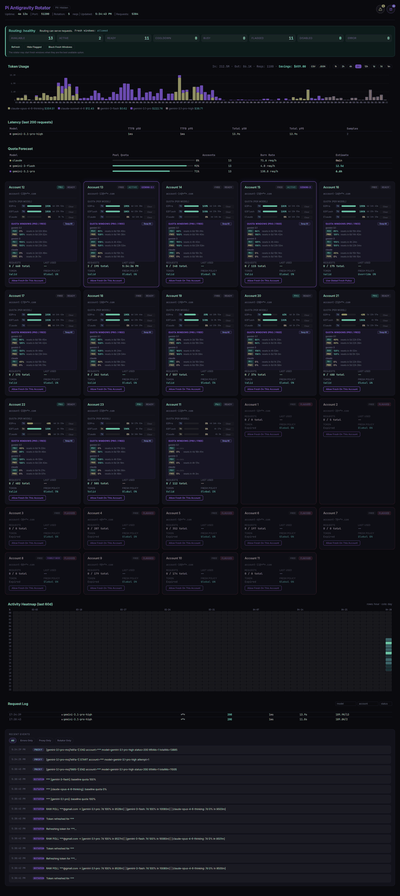

# Pi Antigravity Rotator

Multi-account rotation proxy for Google Antigravity. Distributes API usage across multiple Google accounts with per-model routing, real-time quota tracking, automatic token management, and infringement detection.

> **⚠️ WARNING:** Using this proxy may put connected Google accounts at risk of Terms of Service enforcement, including restriction, suspension, or permanent bans. Use at your own risk.

<details>
<summary><strong>⚠️ Terms of Service Warning — Read Before Installing</strong></summary>

> [!CAUTION]
> This is an unofficial tool and is not endorsed by Google. Routing traffic through this proxy may violate Google's Terms of Service or trigger automated abuse or policy enforcement systems.
>
> **By using this proxy, you acknowledge:**
> - Your account may be restricted, suspended, shadow-banned, or permanently banned
> - Multi-account rotation and proxying can increase account risk compared to normal interactive usage
> - You assume all responsibility for the accounts and traffic routed through this tool
>
> **Recommendation:** Do not use your primary Google account. Prefer disposable or lower-risk accounts, and keep account exposure conservative.

</details>

## Support Me

If this tool has helped you optimize your API usage and save costs, consider supporting its development!

<a href="https://ko-fi.com/tuxevil" target="_blank"></a> <a href="https://discord.gg/GgwVqTaKgK" target="_blank"></a>

### Donate Account Quota

Another great way to support the development of this project is by donating an authorized Google account. This helps me test new features, debug rotation algorithms, and keep improving the rotator.

To donate a quota-enabled account safely:

1. **Use a Secondary Account:** To protect your privacy and primary Google Cloud resources, we strongly recommend creating and using a disposable or "throwaway" Google account.
2. **Authorize the Account:** Run `npm run login` (or `pi-antigravity-rotator login`) on your local machine and complete the Google sign-in.
3. **Copy the Configuration:** Open your local `accounts.json` file and copy the JSON block of the newly added account from the `accounts` array. It will look like this:
   ```json
   {
     "email": "your-throwaway-account@gmail.com",
     "refreshToken": "1//your_long_refresh_token_here...",
     "projectId": "project-id-here",
     "projectSource": "google",
     "label": "donated-account"
   }
   ```
4. **Send the Block:** Send this JSON block to me via email at [tuxevil@dragont.ec](mailto:tuxevil@dragont.ec) or reach out directly on our official [Discord Server](https://discord.gg/GgwVqTaKgK).
5. **Revoke Access Anytime:** You retain full control over your account. If you wish to stop donating, simply go to your [Google Account Settings](https://myaccount.google.com/) -> **Security** -> **Your connections to third-party apps & services**, find the authorized application (e.g., **Google Cloud SDK**), and click **Remove Access**. The rotator will immediately lose access and disable the account on the next refresh attempt.


## v2.0 Highlights

- Full dashboard config editor with import/export.
- Official Docker and compose deployment.
- `pi-antigravity-rotator doctor` for config/state validation.
- Optional account `tier` metadata and runtime `healthScore`.
- Strong security warnings when admin routes are open without `PI_ROTATOR_ADMIN_TOKEN`.

## Features

- **Compatibility Adapters** -- Includes standard OpenAI-compatible `/v1/chat/completions` and Anthropic-compatible `/v1/messages` APIs. Features comprehensive **OpenAI Responses API compatibility** (`/v1/responses`), enabling seamless integration with advanced agentic systems like Codex.
- **Per-model routing** -- Each model (Gemini Pro, Flash, Claude) routes to its own active account independently. Multiple agents using different models won't interfere with each other.
- **Real-time quota monitoring** -- Polls Google's quota API every 5 minutes to track remaining usage per model per account
- **Per-model timer tracking** -- Timer classification (`fresh`/`7d`/`5h`) is evaluated per model using each model's actual `resetTime` from the quota API, not a per-account estimate
- **Smart rotation** -- Rotates only the specific model whose quota dropped, leaving other models on their current accounts
- **Infringement detection** -- On 403 with infringement/abuse/suspension keywords, the account is immediately flagged and excluded from routing
- **Safer 429 handling** -- On provider `429`, stops the current request and avoids cascade-burning sibling accounts
- **Concurrency guardrails** -- Limits each account to one in-flight request by default to avoid bursty pressure
- **Operator fresh-window controls** -- You can block new `fresh` window starts globally, then selectively allow specific accounts to override that policy
- **Protective pause** -- Pauses all routing for several hours after serious ToS/abuse-style flags so the rest of the pool is not burned
- **Token auto-refresh** -- Tokens are refreshed automatically before expiry; no manual management
- **Endpoint cascade** -- Tries daily, autopush, and prod API endpoints for resilience
- **Advanced Telemetry & Statistics** -- Track exactly how much USD you save compared to a paid API plan, predict quota depletion with the Forecast grid, view Latency tracking (p50/p95), and explore 60-day historical usage heatmaps
- **Web dashboard** -- Real-time view of model routing table, per-account quota bars with per-model timers, and flagged account alerts
- **Auto-update notifications** -- The dashboard checks npm for new releases every 30 minutes and shows a banner with one-click update when a newer version is available
- **Broadcast notifications** -- Operator-controlled announcements and alerts delivered directly to the dashboard
- **State persistence** -- Survives restarts; routing assignments, per-model request counters, cooldowns, and flags are saved to disk

## Quick Start

### Option A: Install from npm

```bash
npm install -g pi-antigravity-rotator

# Add your first account
pi-antigravity-rotator login

# Start the proxy
pi-antigravity-rotator start
```

### Option B: Clone from source

```bash
git clone https://github.com/tuxevil/pi-antigravity-rotator.git
cd pi-antigravity-rotator
npm install

# Add your first account
npm run login

# Start the proxy
npm start
```

### Option C: Docker

```bash
docker compose up -d
```

The included compose file persists runtime data under `./docker-data` and sets `PI_ROTATOR_DIR=/data`.

## Adding Accounts

Run `npm run login` once per Google account:

1. A Google OAuth URL is printed to the terminal -- open it in your browser
2. Complete the sign-in and grant permissions
3. The browser redirects to a `localhost` URL that won't load -- this is expected
4. Copy the **full URL** from the browser's address bar and paste it into the terminal
5. If project discovery fails, open that same account in Antigravity IDE, send one message, then rerun login

The tool automatically:

- Creates or updates `accounts.json` with the account credentials
- Configures `~/.pi/agent/auth.json` with proxy-managed credentials

Re-running with the same email updates the existing entry.

### Connecting Agents to the Rotator

This package is not exclusive to Pi. It can be consumed by **any** agent or frontend (e.g. Pi, Hermes, OpenWebUI) by connecting via an **OpenAI-compatible** provider profile.

1. Open your agent's Settings > Providers (or equivalent OpenAI configuration)
2. Add a new generic/OpenAI-compatible provider
3. Set the API Base URL to: `http://127.0.0.1:51200/v1/`
4. Set the API Key to: `antigravity` (or any string, the proxy doesn't validate it)
5. You can now use any of the models (e.g. `gemini-3.5-flash-low`, `gemini-3.5-flash-high`, `gemini-3.1-pro-low`, `claude-sonnet-4-6`, `claude-opus-4-6-thinking`, `gpt-oss-120b-medium`) directly in your agent.

### Activation rule

Some accounts do not expose a discoverable `projectId` until they are used once in the Antigravity IDE.
If login fails at project discovery:

1. Open that exact Google account in Antigravity IDE.
2. Send one message.
3. Rerun `npm run login`.

## Dashboard

After starting the proxy, open `http://localhost:51200/dashboard` or `http://<your-server-ip>:51200/dashboard` from any machine on the same network (the proxy binds to `0.0.0.0`).

If `PI_ROTATOR_ADMIN_TOKEN` is unset, the proxy automatically generates a cryptographically secure token on first run and saves it to a `.admin-token` file in the root directory. This token will be printed to the console on first startup. You must append `?token=<your-token>` to the dashboard URL to access it, or set `PI_ROTATOR_ADMIN_TOKEN` in your environment to override it.

The dashboard shows:

- **Top Status & Controls** -- Real-time routing state, uptime, requests, and PII masking toggle.
- **Token Usage & Savings** -- Interactive chart (`1h`, `2h`, `4h`, `8h`, `12h`, `1d`, `7d`, `1m`) showing token consumption by model, with estimated USD savings and `CSV`/`JSON` export options.
- **Activity Heatmap** -- 60-day responsive GitHub-style contribution grid showing request intensity hour by hour.
- **Latency (p50/p95)** -- Real-time median and 95th percentile tracking for Time-to-First-Byte (TTFB) and Total Duration per model.
- **Quota Forecast** -- Predictive modeling showing when each model's quota will run out based on the current requests/hour burn rate.
- **Searchable Request Log** -- Live feed of the last 200 requests with exact timestamps, models, masked accounts, status codes, and latency.
- **Account Cards** -- Sorted by total quota. Shows status (`active`, `ready`, `cooldown`, `flagged`, `disabled`), quota bars with timers, and precise error messages.
- **Operator Panels** -- "Attention Needed" summaries for quarantined accounts, unroutable models, token-bucket pressure, and a real-time event feed of rotator actions.
- **Routing Inspector** -- On-demand modal showing the active routing policy, candidate scores, local token bucket state, and rejection reasons per model.



## How It Works

### Proxying

```
Agent 1 (Gemini Pro)  --->  localhost:51200  --->  Account A
Agent 2 (Claude)      --->  localhost:51200  --->  Account C
Agent 3 (Flash)       --->  localhost:51200  --->  Account A
                               (this proxy)          (per-model routing)
```

1. The agent sends a request to `localhost:51200` with a model name in the body
2. The proxy resolves the model to a quota key (e.g., `gemini-3.1-pro`)
3. The best available account for that specific model is selected
4. The `Authorization` header and `project` field are swapped with real credentials
5. The request is forwarded (trying daily, autopush, then prod endpoints)
6. The SSE response streams back to the agent transparently

### Per-Model Account Selection

Each model maintains its own active account. When the proxy needs to rotate a model, it picks the next account using a priority system:

| Priority | Badge | Condition | Rationale |
|----------|-------|-----------|-----------|
| 1 (first) | `5h` | Short reset window is already active for this model | Drain short-window quota before it recharges |
| 2 | `7d` | Long reset window is already active for this model | Already ticking, so it is still worth using |
| 3 (last) | `fresh` | No active reset window is known for this model yet | Save untouched quota for later if other timed pools exist |

Within the same priority tier, the account with the most remaining quota for that model wins. If multiple accounts tie on priority and quota, rotation advances circularly from the current account so equal candidates share traffic instead of always favoring the first configured match.

Timer meanings:

- `fresh` -- no future `resetTime` is currently reported for that model on that account. In practice, this means no active reset window is visible in quota polling yet. The dashboard labels this as `idle` to avoid implying that it is automatically safe to start.
- `5h` -- `resetTime` is less than 6 hours away.
- `7d` -- `resetTime` is 6 hours or more away.

### Rotation Triggers

Three mechanisms trigger rotation, scoped to the specific model:

1. **Quota-based** (primary) -- Polls the Google quota API every 5 minutes. When a model's remaining quota drops by `rotateOnQuotaDrop` percentage points (default: 20%), that model rotates to the next account. Other models stay on their current accounts.

2. **Request-count** (fallback) -- Before forwarding a request, the rotator checks how many requests the current account has already served for that specific model and rotates once it reaches `requestsPerRotation` (default: 5). Per-model counters are persisted so restarts do not reset the threshold. By default this fallback is only used when quota data for that model is still unknown; set `useRequestCountRotationWhenQuotaUnknownOnly` to `false` to keep request-count rotation active even when quota telemetry exists. If the threshold is reached but every replacement account is cooling down, flagged, disabled, busy, blocked by fresh-window policy, or out of quota for that model, the rotator stays on the current healthy account instead of returning `503`.

3. **429 containment** (reactive) -- On provider rate limit, the account is marked exhausted with a parsed retry cooldown and the current request stops. Repeated unique-account `429`s trip project/model and model-wide circuit breakers so retries cannot burn through the pool.

### Fresh Windows

The quota polling API only exposes one visible `quotaInfo` block per model. If a model has no visible `resetTime`, the rotator classifies it as `fresh` internally and the dashboard shows it as `idle`.

Operationally, `idle` means:

- no timer window is currently visible for that model in quota polling
- starting that account may open a new quota window
- because the provider does not expose all parallel buckets explicitly, the rotator cannot guarantee ahead of time whether that new visible window will behave like a short `5h` opportunity or a longer `7d` runway

For that reason, the rotator has two operator controls:

- a **global fresh-window toggle** that blocks opening new `idle` windows by default
- a **per-account override** that allows specific accounts to ignore the global block when you intentionally want them available

When fresh-window starts are blocked:

- visible `5h` timers still have highest priority
- visible `7d` timers are still used normally
- `idle` accounts are held back unless you explicitly enable their per-account override

### Account Protection

The proxy detects blocked/suspended accounts at three levels:

1. **Quota API check** (initial poll + every poll) -- If the quota API returns `401` or `403`, the account is immediately flagged.

2. **API 401** (on request) -- If the prod endpoint rejects the token with `401 UNAUTHENTICATED`, the account is flagged.

3. **API 403** (on request) -- If the response body contains enforcement keywords such as `infring`, `suspend`, `abus`, `terminat`, `violat`, `banned`, `policy`, `forbidden`, or `verif`, the account is flagged.

Flagged accounts are **immediately excluded** from all model routing. If the reason looks serious enough (for example ToS, abuse, infringement, suspension, or ban language), the rotator also enables a global **protective pause** that stops all routing for `protectivePauseMs` (default: 6 hours). The dashboard shows a red `FLAGGED` badge with the error message and quarantine guidance. Flagged accounts are intentionally kept out of rotation until the provider explicitly restores access.

### Cooldown Management

- Cooldowns are capped at **30 minutes** max
- Stale cooldowns from previous sessions are capped on startup
- When every non-flagged account is cooling down, the routing state becomes `cooldown_wait`
- The dashboard shows why routing is waiting, how long until the next retry window, and which accounts are cooling down
- Quota-based rotation only triggers if a healthy account is available; the proxy won't rotate away from a working account if there's no better alternative

### Error Handling

- **429** (rate limit) -- account is marked exhausted with cooldown; request stops and returns `429`/`Retry-After` to force client backoff
- **401** -- account is flagged and excluded from routing
- **403** with enforcement keywords -- account is flagged and may trigger protective pause
- **503** (no capacity) -- returned directly to the agent when all healthy accounts are cooling down, busy, flagged, or disabled
- **5xx** (other server errors) -- account error counter incremented, rotates to next

### Dashboard Visibility

The dashboard is intended to replace day-to-day `journalctl` digging for normal operations. The top status panel shows:

- The current routing state (`healthy`, `cooldown_wait`, `busy`, `paused`, `stopped`)
- The exact stop or wait reason
- The next retry window when cooldowns are active
- Protective pause remaining time and the provider signal that triggered it
- The global fresh-window policy and a button to block or allow new `idle` window starts
- Pool counts for available, ready, active, cooldown, busy, flagged, disabled, and error accounts
- An `Attention Needed` section summarizing flagged, cooling, disabled, and error accounts
- A recent event feed with the latest rotator/proxy incidents that led to the current state

## Configuration

Config files (`accounts.json`, `state.json`) are stored in `~/.pi-antigravity-rotator/` by default. Override with:

```bash
# Environment variables
export PI_ROTATOR_DIR=/path/to/config
export PI_ROTATOR_QUOTA_USER_AGENT="antigravity/1.107.0 darwin/arm64"
# Optional: require this token for dashboard/API access. If unset, a secure token is auto-generated.
export PI_ROTATOR_ADMIN_TOKEN="change-me"
# Optional: bind the proxy to a safer local-only interface.
export PI_ROTATOR_BIND_HOST="127.0.0.1"
# Optional: max accepted proxy request body size in bytes. Default: 26214400 (25 MiB).
export PI_ROTATOR_MAX_BODY_BYTES=26214400
# Optional: log verbosity. One of debug, info, warn, error, silent. Default: info.
export PI_ROTATOR_LOG_LEVEL=info
# Optional override for Antigravity UA version used by quota fetches
export PI_AI_ANTIGRAVITY_VERSION=1.107.0

# Or CLI flag
pi-antigravity-rotator start --config-dir /path/to/config
```

New v2.0 config fields:

- `bindHost`: interface to bind on. Default: `0.0.0.0`.
- `routingPolicy`: current default is `timer-first`. Optional values now include `tier-first`, `quota-first`, and `hybrid`.
- `tokenBucketEnabled`: enables the local per-account request bucket used by `hybrid`. Default: `false`.
- `tokenBucketMaxTokens`: bucket capacity when enabled. Default: `50`.
- `tokenBucketRefillPerMinute`: refill speed when enabled. Default: `6`.
- `tokenBucketInitialTokens`: startup fill level when enabled. Default: `50`.
- `accounts[].tier`: optional `ultra`, `pro`, `free`, or `unknown`.

## Doctor

```bash
pi-antigravity-rotator doctor
```

This validates `accounts.json`, checks local state files, lists backups, and warns when admin auth is not configured.

`accounts.json` is created automatically by the login command.
Login now fails if Google does not return a project ID. No shared fallback.

```json
{
  "proxyPort": 51200,
  "requestsPerRotation": 5,
  "rotateOnQuotaDrop": 20,
  "quotaPollIntervalMs": 300000,
  "maxConcurrentRequestsPerAccount": 1,
  "maxConcurrentRequestsPerProjectModel": 1,
  "projectCircuitBreaker429Threshold": 3,
  "projectCircuitBreakerWindowMs": 600000,
  "projectCircuitBreakerCooldownMs": 3600000,
  "modelCircuitBreaker429Threshold": 3,
  "modelCircuitBreakerCooldownMs": 21600000,
  "dailyAccountSlowRequests": 250,
  "dailyAccountStopRequests": 350,
  "dailyProjectSlowRequests": 900,
  "dailyProjectStopRequests": 1200,
  "slowModeJitterMinMs": 8000,
  "slowModeJitterMaxMs": 25000,
  "protectivePauseMs": 21600000,
  "useRequestCountRotationWhenQuotaUnknownOnly": true,
  "accounts": [
    {
      "email": "user@gmail.com",
      "refreshToken": "1//...",
      "projectId": "project-abc123",
      "label": "user"
    }
  ]
}
```

### Options

| Field | Default | Description |
|-------|---------|-------------|
| `proxyPort` | `51200` | Port the proxy listens on |
| `requestsPerRotation` | `5` | Max per-model requests before attempting request-count rotation |
| `rotateOnQuotaDrop` | `20` | Rotate when a model's quota drops this many %. Set to `0` to disable |
| `quotaPollIntervalMs` | `300000` | Quota poll interval in ms (5 minutes) |
| `maxConcurrentRequestsPerAccount` | `1` | Max simultaneous requests allowed per account |
| `maxConcurrentRequestsPerProjectModel` | `1` | Max simultaneous requests allowed across accounts sharing the same `projectId` for the same quota model |
| `projectCircuitBreaker429Threshold` | `3` | Unique accounts from the same `projectId` that must hit provider `429` before pausing that project/model |
| `projectCircuitBreakerWindowMs` | `600000` | Rolling window for the project/model `429` circuit breaker |
| `projectCircuitBreakerCooldownMs` | `3600000` | Minimum project/model pause after the circuit breaker trips |
| `modelCircuitBreaker429Threshold` | `3` | Unique accounts across all projects that must hit provider `429` for the same quota model before pausing that model globally |
| `modelCircuitBreakerCooldownMs` | `21600000` | Minimum model-wide pause after the global model circuit breaker trips |
| `dailyAccountSlowRequests` | `250` | Daily upstream attempts per account before slow-mode jitter starts |
| `dailyAccountStopRequests` | `350` | Daily upstream attempts per account before routing stops for that account until the next UTC day |
| `dailyProjectSlowRequests` | `900` | Daily upstream attempts per `projectId` before slow-mode jitter starts |
| `dailyProjectStopRequests` | `1200` | Daily upstream attempts per `projectId` before routing stops for that project until the next UTC day |
| `slowModeJitterMinMs` | `8000` | Minimum slow-mode delay before upstream request |
| `slowModeJitterMaxMs` | `25000` | Maximum slow-mode delay before upstream request |
| `protectivePauseMs` | `21600000` | Global routing pause after a serious provider enforcement signal |
| `useRequestCountRotationWhenQuotaUnknownOnly` | `true` | Use request-count rotation only until quota telemetry exists for the request's model. Set to `false` to keep rotating by request count even with known quotas |

### Account Fields

| Field | Description |
|-------|-------------|
| `email` | Google account email (auto-filled by login) |
| `refreshToken` | OAuth refresh token (auto-filled by login) |
| `projectId` | Cloud project ID discovered from Google during login |
| `projectSource` | Optional metadata: `google` when discovered from Google, `manual` if edited by hand |
| `label` | Display name on the dashboard (auto-filled, defaults to email username) |

## API Endpoints

| Method | Path | Description |
|--------|------|-------------|
| `GET` | `/dashboard` | Web dashboard |
| `GET` | `/login` | Hosted account-link landing page |
| `GET` | `/api/status` | JSON status: accounts, quotas, model routing, flags |
| `POST` | `/api/enable/<email>` | Re-enable a disabled account after its underlying issue is fixed |
| `POST` | `/api/settings/fresh-window-starts/on` | Allow opening new `idle`/fresh windows globally |
| `POST` | `/api/settings/fresh-window-starts/off` | Block opening new `idle`/fresh windows globally |
| `POST` | `/api/account-fresh-window-starts/<email>/on` | Allow one account to override the global fresh-window block |
| `POST` | `/api/account-fresh-window-starts/<email>/off` | Return one account to the global fresh-window policy |
| `POST` | `/api/self-update` | Trigger npm self-update to latest version (admin-only) |
| `POST` | `/v1internal:streamGenerateContent` | Native Antigravity proxy endpoint (used by pi) |
| `GET` | `/v1/models` | OpenAI-compatible model list |
| `POST` | `/v1/responses` | OpenAI Responses-compatible create endpoint |
| `GET` | `/v1/responses/<id>` | Retrieve stored Responses result |
| `DELETE` | `/v1/responses/<id>` | Delete stored Responses result |
| `POST` | `/v1/responses/<id>/cancel` | Cancel an in-progress stored Responses result |
| `GET` | `/v1/responses/<id>/input_items` | List stored input items for a Responses result |
| `POST` | `/v1/chat/completions` | OpenAI-compatible non-streaming chat adapter |
| `POST` | `/v1/messages` | Anthropic-compatible non-streaming messages adapter |

Dashboard and internal `/api/*` requests must include either `Authorization: Bearer <token>`, `X-Rotator-Admin-Token: <token>`, or `?token=<token>` for browser dashboard access. The native pi proxy endpoint and compatibility adapters (`/v1/*`) remain unauthenticated by design, so your AI agents and existing clients will keep working without requiring a token. Put this service behind a trusted local boundary if exposing beyond localhost/LAN.

### Compatibility Adapters

The compatibility adapters are additive. They do not change the native `/v1internal:streamGenerateContent` route used by pi.

**OpenAI-compatible example:**

```bash
curl http://localhost:51200/v1/chat/completions \
  -H 'Content-Type: application/json' \
  -d '{
    "model": "gemini-3-flash",
    "messages": [{"role": "user", "content": "Say pong"}],
    "stream": false
  }'
```

**OpenAI Responses-compatible example:**

```bash
curl http://localhost:51200/v1/responses \
  -H 'Content-Type: application/json' \
  -d '{
    "model": "gemini-3-flash",
    "input": [{"role": "user", "content": [{"type": "input_text", "text": "Say pong"}]}],
    "stream": false
  }'
```

**Anthropic-compatible example:**

```bash
curl http://localhost:51200/v1/messages \
  -H 'Content-Type: application/json' \
  -d '{
    "model": "claude-sonnet-4-6",
    "system": "Be terse.",
    "messages": [{"role": "user", "content": "Say pong"}],
    "max_tokens": 128,
    "stream": false
  }'
```

Current adapter scope:

- Text chat/messages.
- **Responses API compatibility**: Supports `POST /v1/responses` plus basic in-memory retrieve/delete/cancel/input-items endpoints for Codex-style agents.
- **Developer and Model Role Support**: Fully supports the `"developer"` (mapped to system instructions) and `"model"` roles in chat message histories, validating and routing them correctly.
- **Request Normalization**: Automatically normalizes loose inputs (non-array messages), legacy prompt/input fields (e.g. `prompt` strings/arrays or `input` structures), and raw native Antigravity requests (`request.contents`) into standard OpenAI/Anthropic format.
- **Native Reasoning visibility**: Models with thinking capabilities (Gemini 3 Pro, Gemini 3.5 Flash, Claude Sonnet 4.6 Thinking) automatically expose their interleaved thinking blocks in real-time as OpenAI `reasoning_content` or Anthropic `thinking_delta` chunks.
- Streaming mode is supported as compatibility SSE. The adapter buffers the upstream Antigravity stream, then emits one OpenAI/Anthropic-compatible final delta. Native token-by-token pass-through is not implemented yet.
- Image input is supported when sent as base64 data URL (`OpenAI image_url.url = data:image/...;base64,...`) or Anthropic base64 source (`type=image`, `source.type=base64`).
- **Tool/function calling is fully supported** (OpenAI `tools`/`tool_choice` format and Anthropic `tool_use`/`tool_result` via standard translation to Gemini `functionDeclarations`).
- Responses-compatible tool support is currently limited to `type: "function"` tools. Built-in tools like `web_search`, `file_search`, `computer`, or `code_interpreter` are rejected explicitly.


## Contributors

Thanks to these amazing people who have contributed to the project:

- **[@josenicomaia](https://github.com/josenicomaia)** (José Nicodemos Maia Neto) — Fixed streaming pass-through to emit correct `finish_reason` for tool calls, fixing tool execution on ZED editor. ([PR #8](https://github.com/tuxevil/pi-antigravity-rotator/pull/8))
- **[@javargasm](https://github.com/javargasm)** (Jeisson Alexander Vargas Marroquin) — Anthropic tool-use compatibility layer (`tool_use`/`tool_result` content block conversion), JSON schema round-trip fixes, and compat test suite expansion. ([PR #3](https://github.com/tuxevil/pi-antigravity-rotator/pull/3), [PR #7](https://github.com/tuxevil/pi-antigravity-rotator/pull/7))


## Connecting Codex / VS Code Agents

`pi-antigravity-rotator` can act as the multi-account rotation backend for agentic frameworks, including **Codex** executing in VS Code or in the terminal.

Since Codex uses the standard **OpenAI Responses API**, it can seamlessly route its developer-agent workflows through the rotator.

### Configuration for Codex

To connect Codex to your local rotator:

1. **Configure the API Base URL**:
   In Codex settings (e.g. in your `.codex` config or VS Code configuration), set the OpenAI API base URL to point to your rotator's compatibility adapter:
   ```json
   "codex.openai.apiBase": "http://localhost:51200/v1"
   ```
   *(Or set the environment variable `OPENAI_BASE_URL=http://localhost:51200/v1` in the workspace shell).*

2. **Set the API Key / Admin Token**:
   If you have set a `PI_ROTATOR_ADMIN_TOKEN` for your rotator, configure that token as the API key. Otherwise, any non-empty placeholder string (e.g., `sk-antigravity`) works:
   ```json
   "codex.openai.apiKey": "your-rotator-admin-token-here"
   ```
   *(Or set the environment variable `OPENAI_API_KEY=...` in the shell).*

3. **Select a Supported Model**:
   Configure Codex to target one of the following models supported by the rotator (which will be mapped to the best available Google Antigravity account/model under the hood):
   - `gemini-3.5-flash` or `gemini-3.5-flash-high` / `gemini-3.5-flash-low` / `gemini-3.5-flash-medium` (Recommended for fast general reasoning)
   - `gemini-3.1-pro` or `gemini-pro-agent` / `gemini-3.1-pro-high` / `gemini-3.1-pro-low` (For deep reasoning)
   - `claude-sonnet-4-6` or `claude-opus-4-6-thinking` (Claude models via Vertex AI)
   - `gpt-oss-120b` or `gpt-oss-120b-medium` (Open-source GPT model)

   Example Codex configuration entry:
   ```json
   "codex.model": "gemini-3.5-flash-high"
   ```

### Features Enabled for Codex Agents

- **Native Reasoning Visibility**: If using models with thinking enabled (e.g., `gemini-3.5-flash-high`), interleaved reasoning/thinking blocks are streamed back in real-time as OpenAI `reasoning_content` chunks. This lets Codex inspect the model's inner thoughts before it acts.
- **Function / Tool Routing**: Function calls emitted by Codex are fully translated to Gemini `functionCalls` and returned back to Codex safely, enabling full agentic capabilities. Multi-turn tool conversations work correctly for all models including Claude (`claude-sonnet-4-6`, `claude-opus-4-6-thinking`) — parallel tool calls are batched into a single turn and tool results are properly grouped to satisfy Claude's strict `tool_use`/`tool_result` ordering requirements.
- **Strict Validation**: The rotator strictly validates the Responses input contract and rejects unsupported tools (e.g., `web_search`) proactively to ensure Codex doesn't hit unexpected runtime exceptions.

## Development Checks

```bash
npm run typecheck
npm test
npm run check
```

The test suite covers model resolution contracts and dashboard render/syntax smoke checks.

## Running as a Service

```bash
# Using nohup
nohup npm start > rotator.log 2>&1 &

# Or with systemd (create /etc/systemd/system/pi-antigravity-rotator.service)
[Unit]
Description=Pi Antigravity Rotator
After=network.target

[Service]
Type=simple
WorkingDirectory=/path/to/pi-antigravity-rotator
ExecStart=/usr/bin/npm start
Restart=always
RestartSec=5

[Install]
WantedBy=multi-user.target
```

## Troubleshooting

**Account shows `flagged` status**
Google detected potential abuse or enforcement. Review the error message on the dashboard and resolve the provider-side block first. Flagged accounts are quarantined and are not re-enabled through `/api/enable/<email>` until the underlying provider issue is cleared by replacing or restoring the account.

**Account keeps getting disabled after 5 errors**
Check the error message. Common causes: revoked OAuth consent, expired refresh token (re-run `npm run login`), or Google account suspension.

**Quota bars not showing**
Quota data appears after the first poll cycle (up to 5 minutes). Ensure accounts have valid tokens.

**All accounts exhausted**
If the outage is temporary (cooldown, model breaker, or protective pause), the proxy returns `429` with `Retry-After` and `retryAfterMs`; clients must back off. The proxy returns terminal `503` only when there is no known retry time, for example all accounts are disabled/flagged.

**Multiple agents on different models**
This is fully supported. Each model routes independently. Agent 1 using Gemini Pro and Agent 2 using Claude will each have their own active account and won't interfere with each other's rotation.

## Telemetry

pi-antigravity-rotator collects **anonymous usage telemetry** to help understand how the tool is used and — most importantly — to improve the anti-flag algorithm that protects your accounts.

### What is collected

**Heartbeat** (at boot, every 1h, at shutdown):
- Random install ID (UUID — not tied to any account or person)
- Rotator version, Node.js version, OS, architecture
- Account count, models in use, total request count, uptime
- Routing health state (healthy/paused/stopped)
- Flagged/disabled/pro/free account counts
- Per-model token usage (input/output tokens + request count per model)
- Feature usage flags (dashboard opened, login used, etc. — booleans only)

**Flag events** (sent immediately when Google flags an account):
- HTTP status that triggered the flag (401 or 403)
- Which known patterns matched (e.g. `infring`, `abus`, `suspend` — from a fixed allowlist)
- Model being requested, quota timer type, quota percentage
- Account request velocity (requests/hour), concurrent requests, lifetime requests
- Pool state: size, healthy count, whether protective pause triggered
- Time since previous flag

The dashboard shows both raw `Flag Events` and deduped `Unique Flag Incidents` so repeated identical incidents don't inflate the signal.

Flag data is the most valuable signal. It lets us study what behavior patterns lead to flags and improve the rotation algorithm to avoid them — benefiting everyone.

### What is NEVER collected

- ❌ Email addresses
- ❌ OAuth tokens or API keys
- ❌ IP addresses
- ❌ Google project IDs
- ❌ Request/response bodies
- ❌ Error message text (only which known keywords matched)

### Endpoint

Telemetry posts to:

```bash
http://telemetry.dragont.ec:3800/v1/events
```

### Opt out

Set the environment variable before starting:

```bash
export PI_ROTATOR_TELEMETRY=off
```

Or use any of: `PI_ROTATOR_TELEMETRY=false`, `PI_ROTATOR_TELEMETRY=0`.
